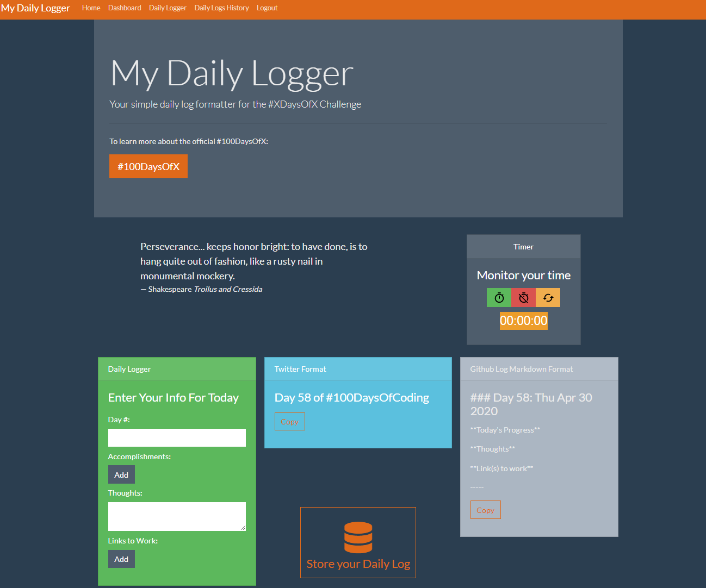

# My Daily Logger

A Daily Log formatter for any XDaysOfX challenge.

## Project Evolution

This project started as a **[simple vanilla JS project](https://sylvaindessureault.com/100daysofcode-daily-logger/)** that I used when I was going through the 100DaysOfCode challenge. After I took [Brad Traversy](https://github.com/bradtraversy)'s [MERN stack course on Udemy](https://www.udemy.com/course/mern-stack-front-to-back/), I decided to migrate the project to a full-blown MERN stack web application.

## Purpose

I originally created this to optimize the daily logs for the challenge. The user can start a timer, start the work on the challenge, enter all the information as challenge progresses and when finished, on the right side of the page, there is a better formatting of the information for both Twitter(text) and Github(markdown) formats.

Thus, with the click of a button, we can then just copy-paste and post on the appropriate platform.

For any contribution request, feel free to send me a message!

## Screenshot of the Daily Logger



## Documentation and Demo

See [documentation](https://sylvaindessureault.com/x-days-of-anything-daily-logger-wiki/) for more details and screenshots.

**[Live demo available](https://sylvaindessureault.com/x-days-of-anything-daily-logger-wiki/assets/demo/pages/demo.html)**.

## Usage for Development

In order to fully use the app, first clone or (download and install) the project, then:

1. Within the root folder as well as the client folder, run:

```bash
npm install
```

2. Set-up your Mongo database and enter the information in an `.env` file:

```bash
MONGO_URI="<Your_Mongo_Uri_Here>"
```

3. In the same `.env` file, enter a string for the JWT token. Example:

```bash
JWTSECRET="<Your_Long_String_Here>"
```

4. Within the root folder, run the app:

```bash
npm run dev
```

## Update

I will most probably pick this project up again, re-designing some aspects of it.

## License

MIT.

Attribution: Bootswatch theme by [Thomas Park](https://thomaspark.co/)
